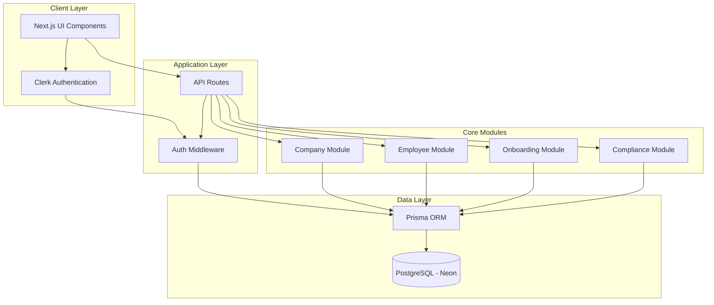
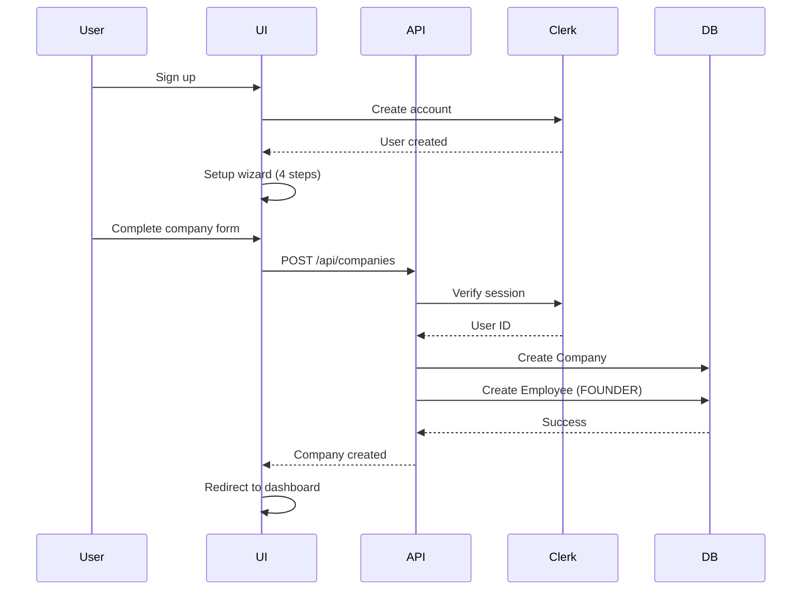
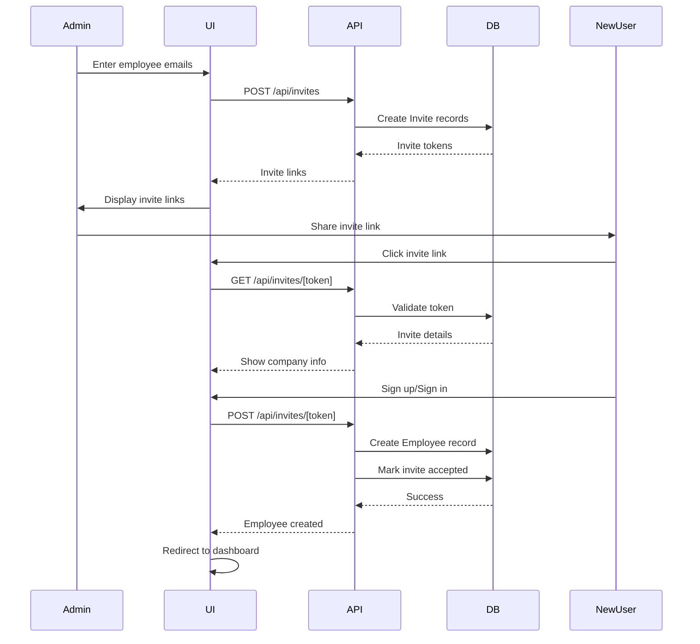
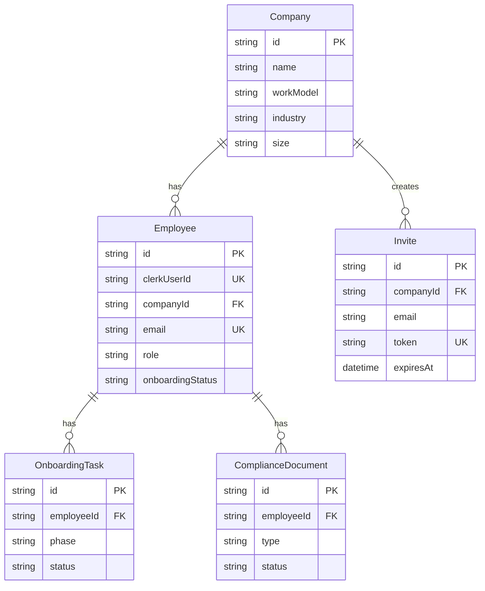

# Waayy HRMS - System Architecture

## Overview

Waayy HRMS is a modern, full-stack Human Resource Management System built for UK businesses. The application follows a **modular monolith architecture** with clear separation of concerns, designed for scalability and maintainability.

---

## Technology Stack

### Frontend

- **Framework:** Next.js 15 (App Router)
- **Language:** TypeScript
- **Styling:** Tailwind CSS + Custom Design Tokens
- **UI Components:** shadcn/ui (Radix UI primitives)
- **Authentication:** Clerk
- **Fonts:** Urbanist (primary), Inter (fallback)

### Backend

- **Runtime:** Node.js
- **API:** Next.js API Routes (REST)
- **Database:** PostgreSQL (Neon - serverless)
- **ORM:** Prisma 5.22
- **Validation:** Zod
- **Authentication:** Clerk (server-side)

### Infrastructure

- **Hosting:** Vercel (recommended)
- **Database:** Neon PostgreSQL
- **File Storage:** Local (TODO: Uploadthing/S3)
- **Version Control:** Git

---

## System Architecture Diagram



---

## Module Architecture

### 1. Authentication Module (Clerk)

**Purpose:** User authentication and session management

**Components:**

- Custom branded login/signup pages
- Email verification flow
- Session management
- Protected routes via middleware

**Routes:**

- `/sign-in` - Login page
- `/sign-up` - Registration page
- `/invite/[token]` - Invite acceptance

**Security:**

- Clerk handles all auth logic
- Server-side session validation
- Protected API routes
- Role-based access control

---

### 2. Company Module

**Purpose:** Company profile and setup management

**Database Schema:**

```typescript
Company {
  id: string
  name: string
  country: string (default: 'UK')
  workModel: WorkModel (REMOTE | HYBRID | OFFICE)
  industry: string?
  size: string?
  employees: Employee[]
}
```

**API Endpoints:**

- `POST /api/companies` - Create company + founder
- `GET /api/companies` - Get user's company
- `GET /api/companies/[id]` - Get company details
- `PATCH /api/companies/[id]` - Update company (admin only)

**UI Components:**

- 4-step setup wizard
- Company profile form
- Work model selection
- Employee invite system

**Business Logic:**

- Founder automatically created on company creation
- First user becomes FOUNDER role
- Company-scoped data access

---

### 3. Employee Module

**Purpose:** Employee management and directory

**Database Schema:**

```typescript
Employee {
  id: string
  clerkUserId: string (unique)
  companyId: string
  firstName: string
  lastName: string
  email: string (unique)
  role: EmployeeRole (FOUNDER | ADMIN | MANAGER | EMPLOYEE)
  department: string?
  startDate: DateTime?
  onboardingStatus: OnboardingStatus
  onboardingTasks: OnboardingTask[]
  complianceDocs: ComplianceDocument[]
}
```

**API Endpoints:**

- `GET /api/employees` - List company employees
- `GET /api/employees/[id]` - Get employee details
- `PATCH /api/employees/[id]` - Update employee
- `POST /api/invites` - Create invitations
- `GET /api/invites` - List invites
- `GET /api/invites/[token]` - Validate invite
- `POST /api/invites/[token]` - Accept invite

**UI Components:**

- Employee dashboard with search
- Employee directory table
- Invite acceptance page
- Employee profile view

**Business Logic:**

- Role-based permissions (FOUNDER > ADMIN > MANAGER > EMPLOYEE)
- Self-update or admin-update only
- Company-scoped access
- Invite token expiry (7 days)

---

### 4. Onboarding Module

**Purpose:** Employee onboarding task management

**Database Schema:**

```typescript
OnboardingTask {
  id: string
  employeeId: string
  phase: OnboardingPhase (PRE | DURING | POST)
  title: string
  description: string?
  status: TaskStatus (PENDING | IN_PROGRESS | COMPLETED)
  dueDate: DateTime?
  completedAt: DateTime?
}
```

**API Endpoints:**

- `POST /api/onboarding/tasks` - Create task (admin only)
- `GET /api/onboarding/tasks` - List tasks
- `PATCH /api/onboarding/tasks/[id]` - Update task status

**UI Components:**

- Task creation form
- Task list with filters
- Task status updates
- Progress tracking

**Business Logic:**

- Three-phase onboarding (Pre/During/Post)
- Admin/Founder can create tasks
- All employees can update own tasks
- Auto-timestamp on completion

---

### 5. Compliance Module

**Purpose:** UK employment compliance management

**Database Schema:**

```typescript
ComplianceDocument {
  id: string
  employeeId: string
  type: ComplianceType (RIGHT_TO_WORK | HMRC_STARTER | GDPR_CONSENT)
  status: DocumentStatus (PENDING | SUBMITTED | VERIFIED | REJECTED)
  documentUrl: string?
  expiryDate: DateTime?
  verifiedAt: DateTime?
  verifiedBy: string?
}
```

**API Endpoints:**

- `POST /api/compliance/documents` - Create document
- `GET /api/compliance/documents` - List documents
- `PATCH /api/compliance/documents/[id]` - Update/verify document

**UI Components:**

- Right to Work verification form
- HMRC Starter Checklist form
- GDPR consent form
- Compliance dashboard with stats
- Document verification interface

**Business Logic:**

- Employee submits documents
- Admin/Founder verifies documents
- Status workflow: PENDING → SUBMITTED → VERIFIED/REJECTED
- Expiry date tracking for Right to Work

---

## Data Flow Architecture

### Company Creation Flow



### Employee Invite Flow



---

## Security Architecture

### Authentication

- **Clerk** handles all authentication
- Server-side session validation on every API call
- Protected routes via middleware
- Automatic session refresh

### Authorization

- **Role-based access control (RBAC)**
  - FOUNDER: Full access
  - ADMIN: Manage employees, verify compliance
  - MANAGER: View team, assign tasks
  - EMPLOYEE: View own data, update own tasks

### Data Access

- **Company-scoped:** All queries filtered by company ID
- **Self-access:** Employees can only modify own data (unless admin)
- **Verification:** Admin/Founder required for sensitive operations

### API Security

- All routes require authentication
- Input validation with Zod
- SQL injection prevention via Prisma
- XSS protection via React
- CSRF protection via Next.js

---

## Database Schema Overview



---

## File Structure

```
waawy-v1/
├── app/
│   ├── (auth)/                    # Auth routes (public)
│   │   ├── sign-in/
│   │   ├── sign-up/
│   │   └── invite/[token]/
│   ├── (marketing)/               # Marketing routes (Landing Page)
│   │   └── page.tsx
│   ├── (dashboard)/               # Protected routes
│   │   ├── dashboard/
│   │   ├── setup/                 # Company setup wizard
│   │   ├── employees/
│   │   └── compliance/
│   ├── api/                       # API routes
│   │   ├── companies/
│   │   ├── employees/
│   │   ├── invites/
│   │   ├── onboarding/
│   │   └── compliance/
│   ├── globals.css
│   └── layout.tsx
├── components/
│   ├── ui/                        # shadcn components
│   └── compliance/                # Compliance forms
├── design-tokens/                 # 3-layer design system
├── lib/
│   └── prisma.ts                  # Prisma client
├── prisma/
│   ├── schema.prisma
│   └── manual-schema.sql
├── docs/
│   ├── architecture.md
│   ├── design-system.md
│   ├── database-setup.md
│   └── neon-troubleshooting.md
└── middleware.ts                  # Auth middleware
```

---

## Design System Architecture

### 3-Layer Token System

1. **Primitives** (`design-tokens/primitives.ts`)
   - Raw values: colors, spacing, typography
   - Brand colors, neutral palette, semantic colors

2. **Aliases** (`design-tokens/aliases.ts`)
   - Semantic tokens: background, text, border
   - Context-aware: light/dark mode support

3. **Components** (`design-tokens/components.ts`)
   - Component-specific tokens
   - Button, input, card styling

### Benefits

- Centralized styling
- Easy theming
- Consistent design
- Type-safe tokens

---

## API Design Principles

1. **RESTful conventions**
   - GET for reading
   - POST for creating
   - PATCH for updating
   - DELETE for removing

2. **Consistent response format**

   ```json
   {
     "success": true,
     "data": {...}
   }
   ```

3. **Error handling**
   - 401: Unauthorized
   - 403: Forbidden
   - 404: Not found
   - 400: Validation error
   - 500: Server error

4. **Validation**
   - Zod schemas for all inputs
   - Type-safe request/response

---

## Deployment Architecture

### Recommended Setup

```
Vercel (Frontend + API)
    ↓
Neon PostgreSQL (Database)
    ↓
Uploadthing/S3 (File Storage - TODO)
```

### Environment Variables

```bash
# Clerk
NEXT_PUBLIC_CLERK_PUBLISHABLE_KEY
CLERK_SECRET_KEY

# Database
DATABASE_URL

# App
NEXT_PUBLIC_APP_URL
```

---

## Scalability Path

### Current: Modular Monolith

- All modules in one codebase
- Shared database
- Single deployment

### Future: Microservices (if needed)

1. Extract modules to separate services
2. API Gateway for routing
3. Separate databases per service
4. Message queue for async operations

### Performance Optimizations

- Database indexing on foreign keys
- Prisma query optimization
- React Server Components
- Edge runtime for API routes
- CDN for static assets

---

## Summary

Waayy HRMS is a production-ready HRMS system with:

- ✅ Complete authentication flow
- ✅ Company management
- ✅ Employee directory & invites
- ✅ Onboarding task system
- ✅ UK compliance (Right to Work, HMRC, GDPR)
- ✅ Role-based access control
- ✅ Modern, scalable architecture
- ✅ Type-safe, validated APIs
- ✅ Beautiful, responsive UI
