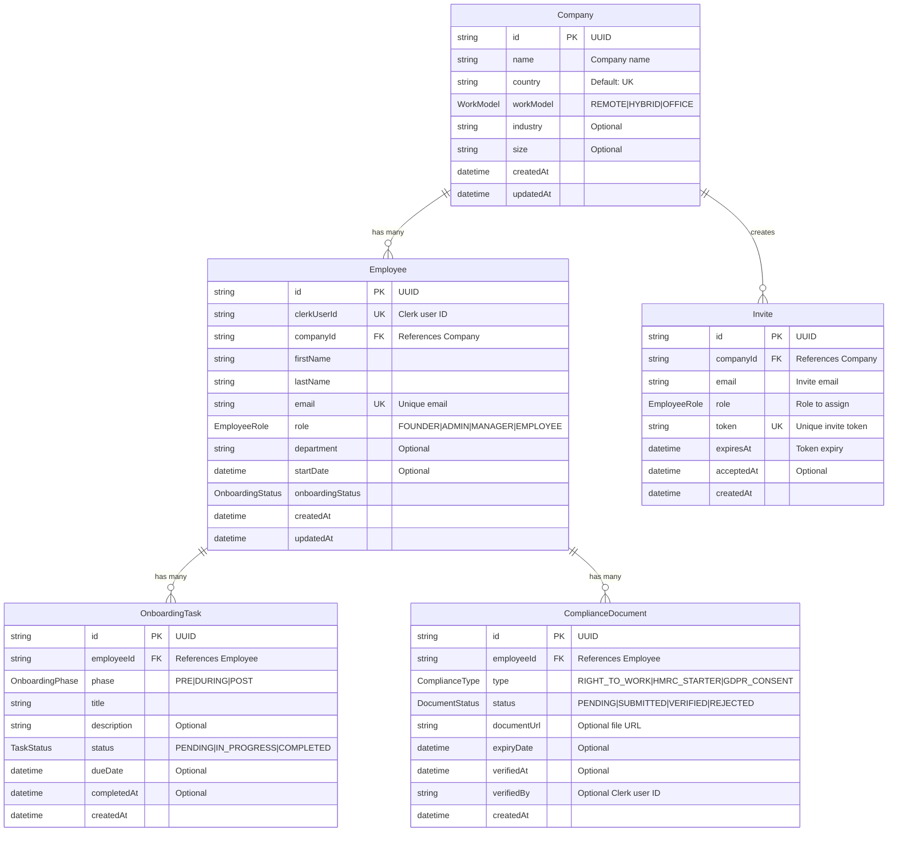

# Waayy HRMS - Database Schema Documentation

## Overview

This document provides complete documentation of the Waayy HRMS database schema, including all tables, relationships, indexes, and enums.

---

## Database Technology

- **Database:** PostgreSQL 14+
- **Hosting:** Neon (serverless PostgreSQL)
- **ORM:** Prisma 5.22
- **Schema File:** `prisma/schema.prisma`
- **Manual SQL:** `prisma/manual-schema.sql`

---

## Entity Relationship Diagram



---

## Tables

### 1. Company

**Purpose:** Stores company profiles and settings

| Column | Type | Constraints | Description |
|--------|------|-------------|-------------|
| id | TEXT | PRIMARY KEY | Unique company identifier (UUID) |
| name | TEXT | NOT NULL | Company name |
| country | TEXT | NOT NULL, DEFAULT 'UK' | Country of operation |
| workModel | WorkModel | NOT NULL | Work arrangement (REMOTE/HYBRID/OFFICE) |
| industry | TEXT | NULLABLE | Industry sector |
| size | TEXT | NULLABLE | Company size (e.g., "1-10", "11-50") |
| createdAt | TIMESTAMP | NOT NULL, DEFAULT NOW() | Creation timestamp |
| updatedAt | TIMESTAMP | NOT NULL | Last update timestamp |

**Relationships:**
- Has many `Employee` (1:N)
- Has many `Invite` (1:N)

**Indexes:**
- Primary key on `id`

---

### 2. Employee

**Purpose:** Stores employee records and profiles

| Column | Type | Constraints | Description |
|--------|------|-------------|-------------|
| id | TEXT | PRIMARY KEY | Unique employee identifier (UUID) |
| clerkUserId | TEXT | NOT NULL, UNIQUE | Clerk authentication user ID |
| companyId | TEXT | NOT NULL, FOREIGN KEY | References Company.id |
| firstName | TEXT | NOT NULL | Employee first name |
| lastName | TEXT | NOT NULL | Employee last name |
| email | TEXT | NOT NULL, UNIQUE | Employee email address |
| role | EmployeeRole | NOT NULL, DEFAULT 'EMPLOYEE' | Employee role |
| department | TEXT | NULLABLE | Department name |
| startDate | TIMESTAMP | NULLABLE | Employment start date |
| onboardingStatus | OnboardingStatus | NOT NULL, DEFAULT 'PENDING' | Onboarding progress |
| createdAt | TIMESTAMP | NOT NULL, DEFAULT NOW() | Creation timestamp |
| updatedAt | TIMESTAMP | NOT NULL | Last update timestamp |

**Relationships:**
- Belongs to `Company` (N:1)
- Has many `OnboardingTask` (1:N)
- Has many `ComplianceDocument` (1:N)

**Indexes:**
- Primary key on `id`
- Unique index on `clerkUserId`
- Unique index on `email`
- Index on `companyId` (for queries)

**Foreign Keys:**
- `companyId` → `Company.id` (CASCADE on delete)

---

### 3. Invite

**Purpose:** Manages employee invitation tokens

| Column | Type | Constraints | Description |
|--------|------|-------------|-------------|
| id | TEXT | PRIMARY KEY | Unique invite identifier (UUID) |
| companyId | TEXT | NOT NULL, FOREIGN KEY | References Company.id |
| email | TEXT | NOT NULL | Invited email address |
| role | EmployeeRole | NOT NULL, DEFAULT 'EMPLOYEE' | Role to assign on acceptance |
| token | TEXT | NOT NULL, UNIQUE | Unique invite token (32-byte hex) |
| expiresAt | TIMESTAMP | NOT NULL | Token expiration (7 days default) |
| acceptedAt | TIMESTAMP | NULLABLE | Acceptance timestamp |
| createdAt | TIMESTAMP | NOT NULL, DEFAULT NOW() | Creation timestamp |

**Relationships:**
- Belongs to `Company` (N:1)

**Indexes:**
- Primary key on `id`
- Unique index on `token`
- Index on `companyId`

**Foreign Keys:**
- `companyId` → `Company.id` (CASCADE on delete)

**Business Logic:**
- Token expires after 7 days
- Can only be accepted once
- Deleted when employee is created (optional)

---

### 4. OnboardingTask

**Purpose:** Tracks employee onboarding tasks

| Column | Type | Constraints | Description |
|--------|------|-------------|-------------|
| id | TEXT | PRIMARY KEY | Unique task identifier (UUID) |
| employeeId | TEXT | NOT NULL, FOREIGN KEY | References Employee.id |
| phase | OnboardingPhase | NOT NULL | Onboarding phase |
| title | TEXT | NOT NULL | Task title |
| description | TEXT | NULLABLE | Task description |
| status | TaskStatus | NOT NULL, DEFAULT 'PENDING' | Task status |
| dueDate | TIMESTAMP | NULLABLE | Due date |
| completedAt | TIMESTAMP | NULLABLE | Completion timestamp |
| createdAt | TIMESTAMP | NOT NULL, DEFAULT NOW() | Creation timestamp |

**Relationships:**
- Belongs to `Employee` (N:1)

**Indexes:**
- Primary key on `id`
- Index on `employeeId`

**Foreign Keys:**
- `employeeId` → `Employee.id` (CASCADE on delete)

---

### 5. ComplianceDocument

**Purpose:** Manages compliance document submissions and verification

| Column | Type | Constraints | Description |
|--------|------|-------------|-------------|
| id | TEXT | PRIMARY KEY | Unique document identifier (UUID) |
| employeeId | TEXT | NOT NULL, FOREIGN KEY | References Employee.id |
| type | ComplianceType | NOT NULL | Document type |
| status | DocumentStatus | NOT NULL, DEFAULT 'PENDING' | Verification status |
| documentUrl | TEXT | NULLABLE | URL to uploaded document |
| expiryDate | TIMESTAMP | NULLABLE | Document expiry (for Right to Work) |
| verifiedAt | TIMESTAMP | NULLABLE | Verification timestamp |
| verifiedBy | TEXT | NULLABLE | Clerk user ID of verifier |
| createdAt | TIMESTAMP | NOT NULL, DEFAULT NOW() | Creation timestamp |

**Relationships:**
- Belongs to `Employee` (N:1)

**Indexes:**
- Primary key on `id`
- Index on `employeeId`

**Foreign Keys:**
- `employeeId` → `Employee.id` (CASCADE on delete)

---

## Enums

### WorkModel
```sql
CREATE TYPE "WorkModel" AS ENUM ('REMOTE', 'HYBRID', 'OFFICE');
```
- **REMOTE:** Fully remote work
- **HYBRID:** Mix of office and remote
- **OFFICE:** Office-based work

---

### EmployeeRole
```sql
CREATE TYPE "EmployeeRole" AS ENUM ('FOUNDER', 'ADMIN', 'MANAGER', 'EMPLOYEE');
```
- **FOUNDER:** Company founder (highest permissions)
- **ADMIN:** Administrator (manage employees, verify compliance)
- **MANAGER:** Manager (view team, assign tasks)
- **EMPLOYEE:** Regular employee (view own data)

**Permission Hierarchy:** FOUNDER > ADMIN > MANAGER > EMPLOYEE

---

### OnboardingStatus
```sql
CREATE TYPE "OnboardingStatus" AS ENUM ('PENDING', 'IN_PROGRESS', 'COMPLETED');
```
- **PENDING:** Not started
- **IN_PROGRESS:** Currently onboarding
- **COMPLETED:** Onboarding finished

---

### OnboardingPhase
```sql
CREATE TYPE "OnboardingPhase" AS ENUM ('PRE_ONBOARDING', 'DURING_ONBOARDING', 'POST_ONBOARDING');
```
- **PRE_ONBOARDING:** Before first day (paperwork, setup)
- **DURING_ONBOARDING:** First week/month (training, introductions)
- **POST_ONBOARDING:** After initial period (ongoing tasks)

---

### TaskStatus
```sql
CREATE TYPE "TaskStatus" AS ENUM ('PENDING', 'IN_PROGRESS', 'COMPLETED');
```
- **PENDING:** Not started
- **IN_PROGRESS:** Currently working on
- **COMPLETED:** Finished

---

### ComplianceType
```sql
CREATE TYPE "ComplianceType" AS ENUM ('RIGHT_TO_WORK', 'HMRC_STARTER', 'GDPR_CONSENT');
```
- **RIGHT_TO_WORK:** UK Right to Work verification
- **HMRC_STARTER:** HMRC Starter Checklist
- **GDPR_CONSENT:** GDPR data processing consent

---

### DocumentStatus
```sql
CREATE TYPE "DocumentStatus" AS ENUM ('PENDING', 'SUBMITTED', 'VERIFIED', 'REJECTED');
```
- **PENDING:** Not yet submitted
- **SUBMITTED:** Awaiting verification
- **VERIFIED:** Approved by admin
- **REJECTED:** Rejected by admin

---

## Data Constraints

### Unique Constraints
- `Employee.clerkUserId` - One employee per Clerk user
- `Employee.email` - One employee per email
- `Invite.token` - One invite per token

### Foreign Key Constraints
All foreign keys use `CASCADE` on delete:
- Deleting a Company deletes all Employees, Invites
- Deleting an Employee deletes all OnboardingTasks, ComplianceDocuments

### Default Values
- `Company.country` = 'UK'
- `Employee.role` = 'EMPLOYEE'
- `Employee.onboardingStatus` = 'PENDING'
- `Invite.role` = 'EMPLOYEE'
- `OnboardingTask.status` = 'PENDING'
- `ComplianceDocument.status` = 'PENDING'

---

## Common Queries

### Get Company with Employees
```sql
SELECT c.*, e.*
FROM "Company" c
LEFT JOIN "Employee" e ON c.id = e."companyId"
WHERE c.id = $1;
```

### Get Employee with Tasks and Compliance
```sql
SELECT e.*, 
       ot.*, 
       cd.*
FROM "Employee" e
LEFT JOIN "OnboardingTask" ot ON e.id = ot."employeeId"
LEFT JOIN "ComplianceDocument" cd ON e.id = cd."employeeId"
WHERE e.id = $1;
```

### Get Pending Invites
```sql
SELECT *
FROM "Invite"
WHERE "companyId" = $1
  AND "acceptedAt" IS NULL
  AND "expiresAt" > NOW();
```

### Get Compliance Status by Company
```sql
SELECT 
  e."firstName",
  e."lastName",
  cd."type",
  cd."status"
FROM "Employee" e
LEFT JOIN "ComplianceDocument" cd ON e.id = cd."employeeId"
WHERE e."companyId" = $1
ORDER BY e."lastName", cd."type";
```

---

## Migration Strategy

### Initial Setup
1. Run `prisma/manual-schema.sql` in Neon SQL Editor
2. Verify tables created: `SELECT * FROM information_schema.tables WHERE table_schema = 'public'`

### Schema Changes
1. Update `prisma/schema.prisma`
2. Generate SQL: `npx prisma migrate dev --create-only`
3. Review migration file
4. Apply: `npx prisma migrate deploy` (or run SQL manually in Neon)

---

## Backup & Recovery

### Backup
```bash
# Using Neon dashboard
# Navigate to: Project → Backups → Create Backup
```

### Export Data
```sql
-- Export to CSV
COPY "Company" TO '/tmp/companies.csv' CSV HEADER;
COPY "Employee" TO '/tmp/employees.csv' CSV HEADER;
```

---

## Performance Considerations

### Indexes
All foreign keys are indexed for query performance:
- `Employee.companyId`
- `Employee.clerkUserId`
- `OnboardingTask.employeeId`
- `ComplianceDocument.employeeId`
- `Invite.companyId`
- `Invite.token`

### Query Optimization
- Use `SELECT` with specific columns (avoid `SELECT *`)
- Use `JOIN` instead of multiple queries
- Add indexes on frequently queried columns
- Use Prisma's `include` for related data

---

## Security

### Row-Level Security (Future)
Consider implementing RLS for multi-tenant isolation:
```sql
ALTER TABLE "Employee" ENABLE ROW LEVEL SECURITY;

CREATE POLICY employee_company_isolation ON "Employee"
  USING ("companyId" = current_setting('app.current_company_id')::text);
```

### Data Encryption
- Passwords: Handled by Clerk (bcrypt)
- Sensitive data: Consider encrypting `documentUrl` at application level
- Database: Neon provides encryption at rest

---

## Troubleshooting

### Common Issues

**1. Type Already Exists**
```sql
-- Solution: Drop and recreate
DROP TYPE IF EXISTS "WorkModel" CASCADE;
CREATE TYPE "WorkModel" AS ENUM ('REMOTE', 'HYBRID', 'OFFICE');
```

**2. Foreign Key Violation**
```
ERROR: insert or update on table "Employee" violates foreign key constraint
```
Solution: Ensure referenced company exists before creating employee

**3. Unique Constraint Violation**
```
ERROR: duplicate key value violates unique constraint "Employee_email_key"
```
Solution: Check if email already exists before insert

---

## Summary

The Waayy HRMS database schema is designed for:
- ✅ Multi-tenant isolation (company-scoped)
- ✅ Role-based access control
- ✅ UK compliance tracking
- ✅ Employee onboarding workflow
- ✅ Scalability and performance
- ✅ Data integrity with foreign keys
